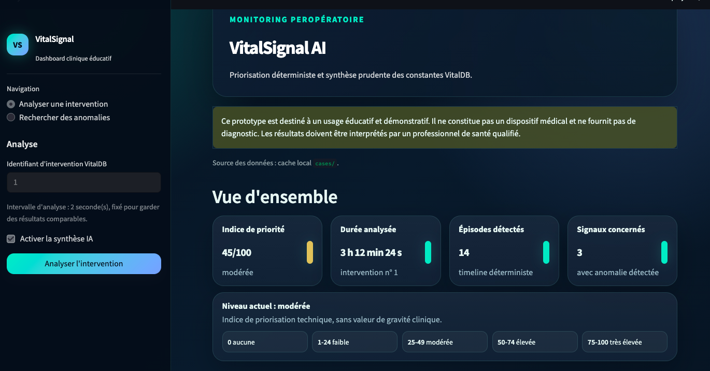
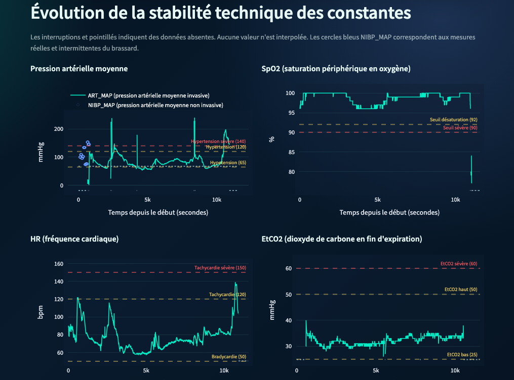
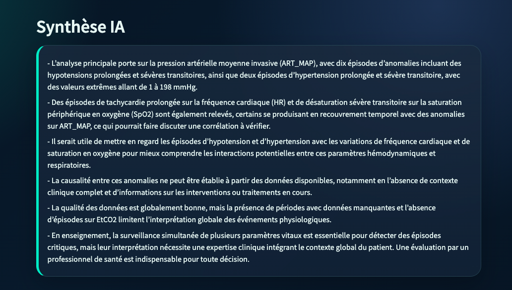

# VitalSignal AI

VitalSignal AI est un prototype éducatif d'analyse de signaux vitaux
peropératoires issus de VitalDB. Il analyse des enregistrements réalisés pendant
une intervention chirurgicale et produit une lecture technique non diagnostique.

Le projet vise trois usages pour la V1 :

* analyser une intervention VitalDB précise ;
* rechercher des interventions contenant certaines anomalies ;
* produire des rapports structurés et une synthèse courte.

## Aperçu







## Périmètre

Un `case_id` VitalDB correspond à l'enregistrement d'une intervention
chirurgicale. Ce n'est pas une mesure isolée ni un suivi postopératoire.

Signaux actuellement traités :

* `ART_MAP` : pression artérielle moyenne invasive (mesure **continue**) ;
* `NIBP_MAP` : pression artérielle moyenne non invasive (mesure **intermittente**, voir ci-dessous) ;
* `SpO2` : saturation périphérique en oxygène ;
* `HR` : fréquence cardiaque ;
* `EtCO2` : dioxyde de carbone en fin d'expiration.

Le pipeline détecte des anomalies simples, contrôle l'exploitabilité des signaux
et calcule un indice de priorité technique. Cet indice sert à orienter la lecture,
pas à mesurer une gravité clinique.

### Échantillonnage et cas du NIBP

Les signaux du Solar8000 sont enregistrés à un pas de `2 s`, ce qui justifie le
traitement à intervalle de `2 s`. Cette hypothèse de mesure continue est valable
pour `ART_MAP`, `SpO2`, `HR` et `EtCO2`.

Elle ne l'est pas pour `NIBP_MAP`. Un brassard oscillométrique mesure de façon
intermittente (typiquement toutes les quelques minutes). Entre deux mesures, la
valeur présente dans l'enregistrement à `2 s` n'est pas une mesure réelle.
Appliquer telle quelle une logique de durée (« sous le seuil pendant `60 s` ») au
`NIBP_MAP` peut donc produire des épisodes qui reflètent l'intervalle de mesure du
brassard, pas un événement physiologique continu. La détection par durée doit être
lue comme **fiable sur `ART_MAP`** et seulement **indicative sur `NIBP_MAP`**. Un
traitement distinct du NIBP, respectant l'intermittence réelle des mesures, est une
limite identifiée à corriger.

### Seuils

Les valeurs de seuil ne sont pas toutes au même niveau de justification. Le tableau
ci-dessous distingue ce qui s'appuie sur la littérature peropératoire de ce qui
relève d'un choix de conception.

| Signal | Modéré | Sévère | Statut de la valeur |
| --- | --- | --- | --- |
| Pression moyenne — hypotension | `< 65 mmHg` | `< 50 mmHg` | **Sourcé.** `65 mmHg` est le seuil absolu de référence en peropératoire. |
| Pression moyenne — hypertension | `> 120 mmHg` | `> 140 mmHg` | **Faiblement étayé.** Paramètre provisoire (voir ci-dessous). |
| `SpO2` | `< 90 %` | `< 85 %` | Repère clinique usuel (`90 %` ≈ PaO2 60 mmHg). |
| `HR` | `< 50` ou `> 120 /min` | `< 40` ou `> 150 /min` | Bornes de surveillance standards, non issues d'une guideline spécifique. |
| `EtCO2` | `< 25` ou `> 50 mmHg` | `< 20` ou `> 60 mmHg` | Bornes d'alerte raisonnables (normale `35–45 mmHg`). |

**Hypotension (le seuil le mieux étayé).** Sous une pression artérielle moyenne de
`65 mmHg`, le risque de lésion rénale et myocardique augmente progressivement avec
la durée d'exposition (Salmasi et al., 2017 ; consensus POQI sur l'hypotension
peropératoire). La fenêtre de `60 s` n'est pas arbitraire : elle correspond à la
définition opérationnelle usuelle d'un épisode hypotensif (MAP `< 65 mmHg` pendant
au moins `1 min`). Le seuil sévère de `50 mmHg` correspond à une hypotension
profonde, où même de courtes durées sont associées à un risque accru.

**Hypertension (le maillon faible, assumé comme tel).** Les seuils de `120` et
`140 mmHg` sont exprimés en pression *moyenne*. Une MAP de `120 mmHg` correspond
déjà à une pression systolique nettement au-dessus de la normale : l'étiquette
« modéré » sous-estime la réalité de la valeur. De plus, l'hypertension
peropératoire est nettement moins associée à des complications postopératoires que
l'hypotension dans la littérature. Ces seuils sont donc des **paramètres de
conception provisoires**, à recalibrer ou à retirer dans une version ultérieure.

### Durées

Les durées minimales utilisées pour qualifier les épisodes doivent être lues comme
des paramètres du prototype, pas comme des seuils de décision clinique. Seule la
fenêtre de `60 s` de l'hypotension s'appuie sur une définition issue de la
littérature (cf. ci-dessus). Les fenêtres modérées de `30 s` appliquées à `SpO2`,
`HR` et `EtCO2` relèvent d'un choix de conception : elles filtrent les fluctuations
isolées et limitent les fausses alertes, dans l'esprit des travaux sur la fatigue
d'alarme et la réduction des fausses alarmes.

La durée courte de `15 s` retenue pour tous les épisodes sévères est une
**simplification de conception conservatrice**, pas une valeur clinique. Elle
suppose implicitement une criticité temporelle équivalente entre des événements
très différents : une bradycardie sévère justifierait en pratique une réaction
quasi-immédiate, là où `15 s` reste raisonnable pour une désaturation. Ce choix est
donc prudent pour certains signaux et perfectible pour d'autres.

Ces références justifient le **principe** d'un filtrage temporel prudent et le seuil
d'hypotension ; elles ne valident pas automatiquement les autres valeurs numériques
retenues ici. Ces seuils et durées sont actuellement codés comme constantes dans les
règles d'analyse et devraient être exposés comme paramètres configurables si le
projet évolue.

Références indicatives :

* Walsh et al., [*Relationship Between Intraoperative Mean Arterial Pressure and
  Clinical Outcomes after Noncardiac Surgery*](https://doi.org/10.1097/ALN.0b013e3182a10e26),
  2013.
* Salmasi et al., [*Relationship between Intraoperative Hypotension, Defined by
  Either Reduction from Baseline or Absolute Thresholds, and Acute Kidney and
  Myocardial Injury after Noncardiac Surgery*](https://doi.org/10.1097/ALN.0000000000001432),
  2017.
* Wesselink et al., [*Intraoperative hypotension and the risk of postoperative
  adverse outcomes: a systematic review*](https://doi.org/10.1093/bja/aey018),
  2018.

* The Joint Commission, [*Sentinel Event Alert 50: Medical device alarm safety in
  hospitals*](https://www.jointcommission.org/en/knowledge-library/newsletters/sentinel-event-alert/issue-50),
  2013.
* Li, Johnson, Mark, [*False arrhythmia alarm reduction in the intensive care
  unit*](https://arxiv.org/abs/1709.03562), 2017.
* Dey et al., [*Weakly Supervised Classification of Vital Sign Alerts as Real or
  Artifact*](https://arxiv.org/abs/2206.09074), 2022.

## Limites

Ce prototype ne prend pas en compte le contexte clinique complet :

* médicaments, anesthésie, ventilation, perfusions ou transfusions ;
* gestes chirurgicaux et étapes de l'intervention ;
* antécédents, biologie, contexte préopératoire ou postopératoire ;
* qualité réelle du capteur, positionnement patient ou référentiel physique.

Les données VitalDB proviennent d'un contexte hospitalier sud-coréen. Une
utilisation française ou européenne nécessiterait une validation externe
multicentrique.

VitalSignal AI n'est pas un dispositif médical et ne fournit pas de diagnostic.

## Installation

Python cible : `3.11`.

```bash
python3.11 -m venv .venv
.venv/bin/pip install -r requirements.txt
PYTHONPATH=src .venv/bin/python -m pytest
```

Interface Streamlit :

```bash
.venv/bin/pip install -r requirements-ui.txt
make ui
```

Lancement Docker :

```bash
cp .env.example .env
make docker-build
make docker-up
```

L'interface est ensuite disponible sur `http://localhost:8501`.

Docker fige l'environnement Python, Streamlit et dépendances. Le fichier `.env`
reste local : il n'est pas copié dans l'image Docker. Docker Compose le monte en
lecture seule dans le conteneur pour que l'application puisse charger
`OPENAI_API_KEY` et `OPENAI_MODEL`. Si tu ne veux pas utiliser la synthèse IA,
laisse simplement `OPENAI_API_KEY` vide.

Commandes utiles :

```bash
make test
make demo
make clean-cache
make docker-down
```

La suppression des données locales éventuelles est volontairement séparée :

```bash
make clean-cases
```

### Note pyarrow

Sur certains environnements macOS restreints ou sandboxés, `pyarrow` peut afficher
des warnings du type :

```text
sysctlbyname failed ... Operation not permitted
```

Ces messages viennent de la détection bas niveau des capacités CPU par `pyarrow`.
Ils sont non bloquants tant que la commande continue et produit le rapport ou lance
l'interface. Ils ne signifient pas que l'analyse VitalSignal AI a échoué.

## Cache local VitalDB

La première analyse d'une intervention nécessite un téléchargement depuis VitalDB.
Les constantes récupérées sont ensuite stockées localement dans `cases/`.

Au chargement suivant de la même intervention avec le même intervalle, VitalSignal AI
lit directement la copie locale :

```text
1re analyse intervention 42 → téléchargement VitalDB → cache local
2e analyse intervention 42 → lecture depuis cases/
```

Ce cache rend l'interface plus rapide, réduit les appels réseau et permet de
retravailler hors ligne sur les interventions déjà téléchargées. Le dossier
`cases/` est ignoré par Git.

Pour supprimer les données VitalDB mises en cache :

```bash
make clean-cases
```

## Utilisation CLI

Analyser une intervention :

```bash
PYTHONPATH=src .venv/bin/python -m vitalsignal.main 3
```

Exporter un rapport :

```bash
PYTHONPATH=src .venv/bin/python -m vitalsignal.main 3 --format json --output reports/intervention_3.json
PYTHONPATH=src .venv/bin/python -m vitalsignal.main 3 --format markdown --output reports/intervention_3.md
```

Rechercher des anomalies sur plusieurs interventions :

```bash
PYTHONPATH=src .venv/bin/python -m vitalsignal.search_cli --start-case-id 1 --end-case-id 5 --anomaly tachycardia
```

Auditer la distribution de l'indice :

```bash
PYTHONPATH=src .venv/bin/python -m vitalsignal.score_audit_cli --start-case-id 1 --end-case-id 50 --output reports/score_audit_1_50.json
```

Par défaut, les commandes de scan refusent les plages trop larges afin d'éviter un
téléchargement VitalDB involontairement long.

## Interface

L'interface Streamlit contient deux vues :

* `Analyser une intervention` : analyse détaillée d'une intervention ;
* `Rechercher des anomalies` : scan multi-cas par type d'anomalie.

L'analyse détaillée affiche :

* l'indice de priorité ;
* une synthèse courte ;
* une timeline chronologique ;
* des graphiques par constante ;
* l'exploitabilité des signaux ;
* des exports Markdown et JSON.

La recherche multi-cas affiche un graphique de fréquence des anomalies et un
tableau des interventions correspondantes. Par sécurité, l'interface refuse les
scans de plus de 50 interventions et affiche une progression pendant le scan.

Dans l'interface, l'intervalle d'échantillonnage est fixé à `2 s` pour l'analyse
détaillée et pour la recherche multi-cas, afin de garder les résultats comparables.

## IA

L'agent IA est optionnel. Le pipeline déterministe fonctionne sans clé API.

Configuration locale possible dans `.env` :

```text
OPENAI_API_KEY=
OPENAI_MODEL=gpt-4.1-mini
```

Pour la V1, le choix par défaut est un modèle peu coûteux (`gpt-4.1-mini`). La
valeur médicale du prototype vient d'abord du pipeline déterministe : règles,
contrôle qualité, indice de priorité, graphiques et données structurées. L'IA
sert à produire une synthèse courte et à formuler des pistes de lecture, pas à
remplacer l'analyse logicielle ni l'expertise clinique.

La synthèse IA reçoit des données structurées et doit rester prudente. Elle peut
proposer des axes de lecture, des corrélations à vérifier et des questions utiles,
mais ne doit pas conclure à une causalité ni poser de diagnostic. En cas d'échec
ou d'absence de clé, une synthèse locale déterministe reste disponible.

Pour alléger l'affichage, la synthèse IA utilise les noms courts des constantes
(`ART_MAP`, `SpO2`, `HR`, etc.) sans répéter leur signification entre parenthèses.

Le réglage OpenAI utilise une température de `0.1`. Ce choix garde des réponses
majoritairement stables, tout en laissant assez de souplesse pour formuler des
questions de vérification et une lecture qualitative moins mécanique.

Évolution V2 possible : comparer plusieurs modèles sur les mêmes rapports
structurés, par exemple un modèle plus avancé pour améliorer la qualité de la
synthèse, ou un modèle local pour explorer un fonctionnement offline. Cette
évolution devra être évaluée sur des critères simples : coût, latence, stabilité
des réponses, clarté pour un utilisateur français/européen et absence de
surinterprétation médicale.

Autre piste V2 : exposer le pipeline via FastAPI pour fournir des endpoints JSON
à un front séparé ou à d'autres outils. Cette API n'est pas nécessaire à la V1,
car l'interface Streamlit couvre déjà l'usage démonstrateur local.

## Avertissement

Ce projet est destiné à un usage éducatif, démonstratif et portfolio.
Il ne constitue pas un dispositif médical.
Les résultats doivent être interprétés par un professionnel de santé qualifié.
